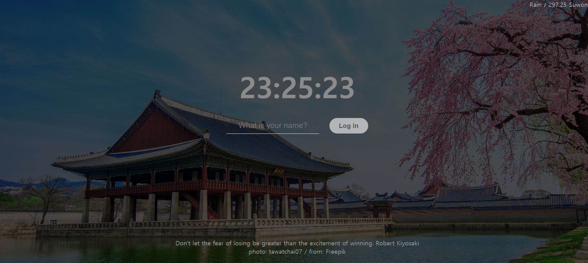

# Greeting.js

`document.querySelector()`ë¥? ?†µ?•´?„œ ?•´?‹¹ html?ƒœê·?, id, classë¥? ê°?? ¸?˜¬ ?ˆ˜ ?žˆ?‹¤. ?�´ ?•¨?ˆ˜?Š” ?•œ ê°œì�˜ 값만 불러?˜¤ë©?, ê°™ì?? classë¥? ?“°?Š” ?—¬?Ÿ¬ ?ƒœê·¸ë“¤?�„ ê°?? ¸?˜¤ê¸? ?œ„?•´?„  All?�„ 붙여 ?‚¬?š©?•œ?‹¤.

```jsx
const loginForm = document.querySelector("#login-form");
```

### ë³??ˆ˜ ?„¤? •

- `const` 초기?™”ê°? ?�˜?–´?•¼ ?•˜ë©? ?ˆ˜? •?�´ 불ê???Š¥?•˜?‹¤. ???게로 ?�´ ????ž…?œ¼ë¡? ?„ ?–¸?•œ?‹¤.
- `let` ë³??ˆ˜?�˜ ?ˆ˜? •?�´ ê°??Š¥?•˜?‹¤.

### Class��

- `document.querySelector()` ?†µ?•´ ? •ë³´ë?? 받아?„œ ë³??ˆ˜?—� ????ž¥?�„ ?•˜????‹¤. `.classList` ë¥? ?†µ?•´ ê°�ì²´ê°? ê°?ì§?ê³? ?žˆ?Š” ?�´?ž˜?Š¤?“¤?�„ ? „ë¶? ?‚´?Ž´ë³? ?ˆ˜ ?žˆê³?, ?�´?ž˜?Š¤ë¥? ?„£ê³? 빼는 ?ž‘?—…?�„ ?•  ?ˆ˜ ?žˆ?‹¤.

```css
.hidden{
    display: none;
}
```

?˜ˆë¥? ?“¤?–´ `.hidden` ?�¼?Š” ?�´?ž˜?Š¤ë¥? ?„£ê³? 빼는 ?ž‘?—…?�„ ?•¨?œ¼ë¡œì�¨ ?Ž˜?�´ì§??�˜ ?š”?†Œ?“¤?�„ ê´?리할 ?ˆ˜ ?žˆ?‹¤.

- `ê°�ì²´.innerText` ë¥? ?†µ?•´ HTML?‚´ë¶??�˜ ?…�?Š¤?Š¸ë¥? ë°”ê?? ?ˆ˜ ?žˆ?‹¤.

### formating

`??œë¬¸?ž�?—´???` ?‚˜ `??˜ë¬¸?ž�?—´???` ê°? ?•„?‹Œ ``${ë³??ˆ˜ëª?}`` ë¥? ?�´?š©?•˜?—¬ format?�„ ?•  ?ˆ˜ ?žˆ?‹¤. 

### localstroage

브ë�¼?š°????—�?Š” localstorageê°? 존재?•œ?‹¤. 브ë�¼?š°??? ?‚´?—� ?ž‘??? ?�°?�´?„°ë² ì�´?Š¤??? 같다. `form` ?ƒœê·¸ë?? ?†µ?•´ ? œì¶œí•˜ê²? ?�˜ê±°ë‚˜, ?›¹?�´ ?ƒˆë¡? 고침 ?�  경우 브ë�¼?š°??? ?‚´ ?�°?�´?„°?Š” 초기?™”ê°? ?�œ?‹¤. ?�´ë¥? ë°©ì???•˜ê¸? ?œ„?•´?„œ localstorage?—� ? ‘근한?‹¤. `localstorage.setItem(key, value)` ë¡? ?„¤? •?•  ?ˆ˜ ?žˆ?‹¤. ?�´?š© 방법??? dictinary??? 매우 ?œ ?‚¬?•˜?‹¤. 

### EventListner

?�¼?�„ ??˜ì œì¶œâ?? ?•˜ê±°ë‚˜ ?˜�?Š” 버튼?�„ ??˜í�´ë¦???? ê·? ?™¸?�˜ 많ì?? ?�´ë²¤íŠ¸ê°? ë°œìƒ�?•œ?‹¤. `document.querySelector()` ë¡? ê°�ì²´ë¥? 받아 ????ž¥?•˜ê³?, ?•´?‹¹ ê°�ì²´?—� ????•´ `.addEventListener("?�´ë²¤íŠ¸", ?•¨?ˆ˜)` ë¥? ?†µ?•´ ?•´?‹¹ ?�´ë²¤íŠ¸ê°? ë°œìƒ�?–ˆ?�„ ?•Œ ?•¨?ˆ˜ë¥? ?ž‘?�™?•  ?ˆ˜ ?žˆ?‹¤. ?•¨?ˆ˜ë¥? ?�¸?ž�ë¡? ?‚¬?š©?•  ?•Œ ()ë¥? ?„£ì§? ?•Š?�„ë¡? ?•œ?‹¤.

- ?ž‘?�™ ?‹œ?‚¬ ?•¨?ˆ˜ë¥? 구현?•  ?•Œ, ?•¨?ˆ˜?�˜ ?ŒŒ?�¼ë¯¸í„°ë¡? eventë¥? ?„£?�„ ?ˆ˜ ?žˆ?‹¤. `event.preventDefault()` ë¥? ?†µ?•´ ?•´?‹¹ ?�´ë²¤íŠ¸ê°? ë°œìƒ�?•˜?Š” 것ì�„ 막ì�„ ë¿�ë�”?Ÿ¬ ?‹¤ë¥? 메소?“œë¥? ?™œ?š©?•˜?—¬ ?‹¤?–‘?•œ 코드ë¥? ?™„?„±?•  ?ˆ˜ ?žˆ?‹¤.

---

# clocks.js

### Date()

- `const date = new Date();` 코드ë¥? ?†µ?•´ ?˜„?ž¬ ?‹œê°„ì�„ 불러?˜¬ ?ˆ˜ ?žˆ?‹¤. ê°�ì²´?—� 매소?“œë¥? ?™œ?š©?•˜?—¬ ?‹œê°?, ?‚ ì§?, ë°? ?…„?�„ë¥? 불러?‚¼ ?ˆ˜ ?žˆ?‹¤.
- `setInterval(?•¨?ˆ˜, ì´?)` ?•´?‹¹ ?•¨?ˆ˜ê°? ì§?? •?•œ ì´ˆë?? 간격?œ¼ë¡? ?‹¤?–‰?�˜ê²? ?•œ?‹¤.
- `.padStart(?ˆ«?ž�, "문ìž�")` ?•´?‹¹ string ê°�ì²´ ?•ž?�„ ì§?? •?•œ ?ˆ«?ž�?—� 맞게 문ìž�ë¥? 채워 ?„£?Š”?‹¤.

---

# quotes.js

### Math

- `Math.floor` ?ˆ«?ž�ë¥? ?‚´ë¦¼í•œ?‹¤.
- `Math.random()` 0ë¶??„° 1?‚¬?�´?�˜ ?ˆ«?ž�ë¥? ?žœ?�¤?•˜ê²? ?‘œì¶œí•œ?‹¤. ?›�?•˜?Š” 범위ê°? ?žˆ?‹¤ë©?, ê·? ?ˆ«?ž�만í�¼ 곱하ë©? ?�œ?‹¤.

---

# background.js

### HTML?ƒœê·? 만들ê¸?

- `document.createElement("?ƒœê·?")` 문서 ?‚´?—� ?ƒœê·¸ë?? 만들 ?ˆ˜ ?žˆ?‹¤.
    - ?ƒœê·¸ê?? ?ƒ�?„±?�˜ë©? ?•´?‹¹ ?ƒœê·¸ê?? ê°?ì§??Š” ?†�?„± ?˜�?•œ js?‚´?—�?„œ ?ˆ˜? • ê°??Š¥?•œ?‹¤.
- `.appendChild(?ƒœê·? ë³??ˆ˜)` ?ƒœê·¸ë?? ?œ„치할 ê³³ì�„ ì§?? •?•œ?‹¤. ?•´?‹¹ ê°�ì²´?�˜ ?ž�?‹� ?š”?†Œë¡? ?“¤?–´ê°„다.

---

# weather.js

### ?œ„치ë?? ?‚˜????‚´?Š” ?•¨?ˆ˜

```jsx
navigator.geolocation.getCurrentPosition(onGeoOk,onGeoError);
```

js?—� 기본?œ¼ë¡? 깔려?žˆ?Š” 모듈?�´?‹¤. ì²? 번째 ?�¸?ž�?Š” ?˜„?ž¬ ?œ„치ë?? ?�´ë²¤íŠ¸ë¡? 받는?‹¤`. coords` ë¥? ?†µ?•´ ?œ„?�„??? ê²½ë�„ë¥? 구할 ?ˆ˜ ?žˆ?‹¤.

```jsx
fetch(url).then(response => response.json())
    .then((data) => {
        const weather = document.querySelector("#weather span:first-child");
        const city = document.querySelector("#weather span:last-child");
        city.innerText = data.name;
        weather.innerText = `${data.weather[0].main} / ${data.main.temp}`;
    })
```

- fetchë¡? url?�„ 불러?˜¨?‹¤. ?�´ ?ž‘?—…??? ?‹œê°„ì�„ ?˜¤?ž˜ ?ž¡?•„먹는?�° 컴퓨?„°?Š” pipeline ?˜•?ƒœë¡? ?�™?‹œ ?‹¤ë°œì �?œ¼ë¡? ?ž‘?—…?�„ 진행?•œ?‹¤. ?”°?�¼?„œ ?•´?‹¹ ?�°?�´?„°ë¥? ?–»ê¸°ë�„ ? „?—� ê´?? ¨ 코드ë¥? ?‹¤?–‰?•´ë²„릴 ?ˆ˜ ?žˆ?‹¤?Š” 것ì�´?‹¤.
- `.then` ??? ê°�ì²´ê°? ?‹¤?–‰?�˜?–´?•¼ ?‹¤?�Œ 코드ê°? ?‹¤?–‰?�  ?ˆ˜ ?žˆê²? 진행?•œ?‹¤. `response` ë¡? ?�°?�´?„°ë¥? 불러?˜¤ê³? `json` ?–¸?–´ë¡? ë³??™˜?‹œ?‚¨?‹¤. ?˜�?•œ ê´?? ¨ ?�°?�´?„°?“¤?�„ ????ž¥?•˜?—¬ ?™œ?š©?•  ?ˆ˜ ?žˆ?‹¤.

---

# toDo.js

?•ž?„œ ?–¸ê¸‰í•œ ê°œë…�?“¤?�„ ? �ê·? ?™œ?š©?•œ?‹¤. 

to do 목ë¡�?�„ 만들ê³? ì§??š°?Š” ?ž‘?—…?�„ ?•œ?‹¤. ?•˜ì§?ë§? ì§??š¸ ?‹œ 목ë¡�?�˜ ?‚´?š©?�´ 같으ë©? ?‘� ê°œì�˜ 목ë¡�?�´ ?�™?‹œ?—� ì§??›Œì§?ê¸? ?•Œë¬¸ì—� ê°? ?•­ëª©ì—� ????•œ IDë¥? 만들기로 ?•œ?‹¤. ?†’ Dateë¥? ?�´?š©?•œ ?‹œê°„ë?? 별로 ?‹¤ë¥? ê°? ? �?š©

- to do 리스?Š¸ê°? 브ë�¼?š°??? ?‚´?—� ????ž¥?�˜ê²? ?•˜?—¬ê¸? log in ?•˜????�„ ?•Œ 목ë¡�?�´ ?‘œ?‹œ?�˜?�„ë¡? ?•œ?‹¤.
    - 리스?Š¸ ?‚´?š©?�„ localstorage?—� ????ž¥?•œ?‹¤. ?•˜ì§?ë§? ?�´ DB?Š” stringë§? ê°??Š¥?•˜ê¸? ?•Œë¬¸ì—� ????ž… ë³??™˜ ?‹œì¼œì¤˜?•¼ ?•œ?‹¤. ?†’ `JSON.stringify(ê°�ì²´)` ë¡? ????ž… ë³??™˜ ?‹œ?‚¬ ?ˆ˜ ?žˆ?‹¤.
    - filter?•¨?ˆ˜ ?‚´ lamda?‹�?�„ ?™œ?š©?•˜?—¬ 리스?Š¸ë¥? ì¡°ì •?•  ?ˆ˜ ?žˆ?‹¤.
    
    ```jsx
    	 toDos = toDos.filter((toDo) => toDo.id !== parseInt(li.id));
    ```
    

---

## Website-preview




