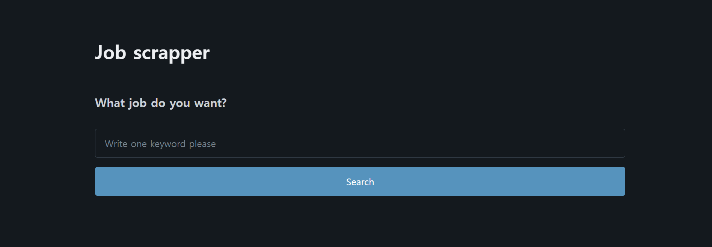
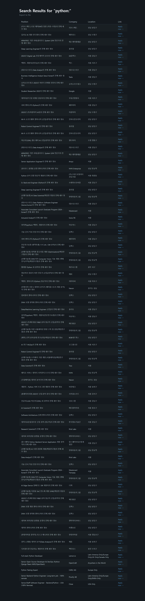

# wwr.py

- web을 local로 불러오는 작업을 한다 → request 패키지로부터 get을 import 한다.
    - 응답에 성공할 시 200을 반환한다. (각 형식에 맞는 반환 값 존재 ex)404: 페이지 찾을 수 없음
- response 받은 페이지를 html 태그에 맞게 python entry로 바꾸기 위해 BeautilfulSoup를 이용한다.
- `객체.find_all("태그",class_="클래스명")` 지정 클래스에 맞는 태그를 모두 찾아서 list로 반환
- 리스트로 반환하였으니 iterator 사용 가능 → for문을 통해 각 요소에 맞게 또 find_all을 사용가능

<aside>
? html 문서를 개발자 도구를 통해 읽어보며 자신이 스크랩 해야 하는 코드가 어디에 어떤 class를 사용하며 위치하고 있는 지 파악하는 것이 중요하다

</aside>

- 다 찾았다면, 해당 데이터들을 모아서 하나의 딕셔너리 형태로 만들어 준다. 그리고 리스트에 딕셔너리를 추가해주면서 페이지 내에 있는 모든 데이터들을 리스트의 각 요소로 넣는다.
- 리스트를 반환한다.

# indeed.py

위의 wwr.py는 웹에서 사용자가 봇인지 확인하지 않았다. 접근이 편하게 가능했다는 말이다. 하지만 이번에 스크랩할 사이트는 AI사용자의 접근을 막았다. 따라서 위와 같이 접근하는 게 불가능하다. 하지만 브라우저로 해당 웹을 띄우는 것은 가능하다. 우리는 브라우저를 띄우고 그것을 통해 내부 html 문서를 열어볼 것이다.

- selenium 패키지가 필요하다. 여기서 webdriver와 Option을 import할 것이다.
    
    ```python
    options = Options()
    driver = webdriver.Chrome(options=options)
    ```
    
    위의 코드는 웹을 구동할 준비를 한다.
    
- 그리고 `driver.get(”url”)` 을 실행할 경우 해당 url을 가진 사이트를 크롬을 통해 열 것이고, `driver.page_source` 은 그 html문서를 텍스트로 받아오는 역할을 한다. 마찬가지 이 텍스트를 BeatifulSoup로 받아 `“html.parser”` 를 할 것이다.

**이후로는 전 wwr.py와 매우 유사하다. 차이점만 나열해보겠다.**

- 여기서는 `.find_all('태그', recursive=False)` 가 추가가 됐다.

recursive가 의미하는 것은 바로 아래에 있는 요소만 가져오겠다는 것을 의미한다. 해당 요소 깊숙이 똑같은 태그가 있을 수 있기 때문이다. → 위를 방지하고 유용하게 잘 쓰기 위해서는 아까 언급한 바와 같이 문서 내부를 주의 깊게 살펴볼 필요가 있다.

- `job.select_one("h2 a")`  코드가 추가가 됐다. 해당 코드는 h2 안에 있는 a 태그에 접근하겠다는 말이다. 두 줄로 적을 코드를 한 줄로 줄일 수 있다.
- a태그를 가져올 경우 해당 attribute(속성)이 존재하는데, 그 예시로는 title, link 등이 있다. 이러한 속성들은 딕셔너리 형태로 저장되므로 속성 이름을 key로 입력하여 value를 가져오면 된다.
- `get_page_count(keyword)` 함수라는 것이 추가가 됐다. 이 함수는 페이지를 나타내는 요소를 가져와서 개수를 읽고 그 개수만큼 스크랩 코드를 반복하기 위함이다.

# file.py

- 데이터들은 날라가기 마련이므로 파이썬으로 파일을 열고 닫아 csv파일을 만드는 역할을 한다

# main.py

본격적인 main함수의 시작이다. 이 py에서는 flask를 통해 백엔드 구현을 하는 것이 목표다.

from flask import Flask, render_template, request, redirect, send_file

호출 받을 항목들이다.

1. 먼저 `app = Flask("Jobscrapper")` 플라스크 애플리케이션을 생성한다. 내부 string값은 아무래도 상관 없다.
2. `@app.route("/")` URL과 플라스크 코드를 매핑하는 플라스크의 데코레이터이다. 바로 아래에 있는 함수를 실행시킨다.
3. `return render_template("home.html",name=name)` home.html이라는 템플릿을 연다. 이 때 같은 폴더 아래에 정확히 **templates**라는 폴더가 있어야 한다. flask가 이 폴더를 훑기 때문이다. 또한 두 번째 인자는 변수 역할이다. html문서 내의 변수를 지정 가능하다. html 문서 내에서 {{name}}으로 사용될 수 있다.
4. `keyword = request.args.get("keyword")` 입력한 keyword를 get한다 -input form에서 value name을 keyword라 설정했기 때문이다.
5. `redirect("/")` 는 “/” 즉 홈페이지로 다시 돌아간다는 말이다.
6. `return send_file(f"{keyword}.csv", as_attachment=True)` 파일을 .csv형태로 만들어 보내는 역할을 한다. as_attachment는 파일을 다운로드 할 수 있게 해준다. 
7. 이 모든 기능들이 검색을 새로 할 경우 다시 처음부터 스크랩이 된다. 이를 방지하기 위해서 처음 스크랩을 하는 것을 제외하고 두 번째 시도 이후부터는 바로 로딩이 되게 임시 db를 코드 내에 삽입한다.

# search.html

태그 및 요소와 관련된 코드가 아닌 파이썬 코드를 사용하고 싶다면

```html

      <tr>
      <td>{{job.position}}</td>
      <td>{{job.company}}</td>
      <td>{{job.location}}</td>
      <td><a href="{{job.link}}" target="_blank">Apply now &rarr;</a></td>
      </tr>

```

이와 같이 사용 하면 된다. {{값}} 은 메인에서 rendering 했을 때, 명시한 파라미터들을 변수로 사용하는 것이다.



